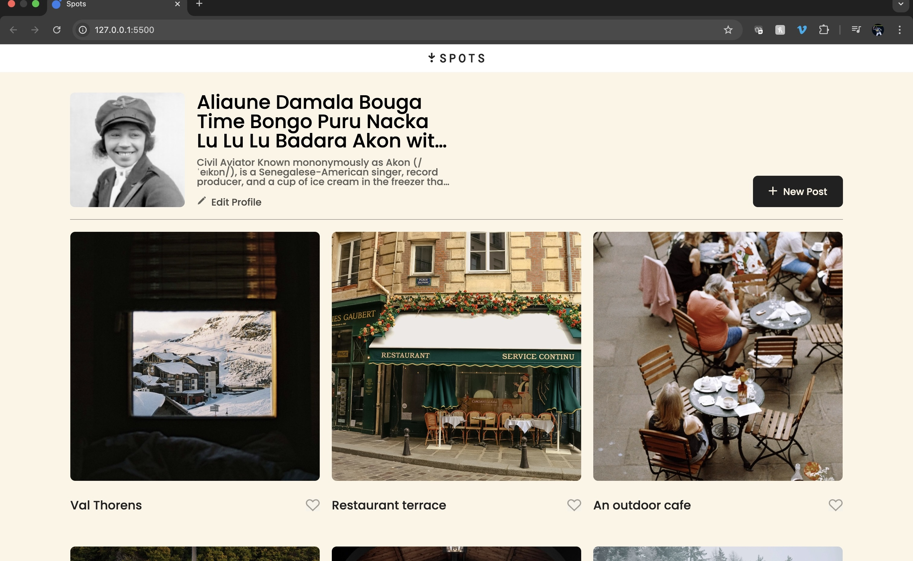
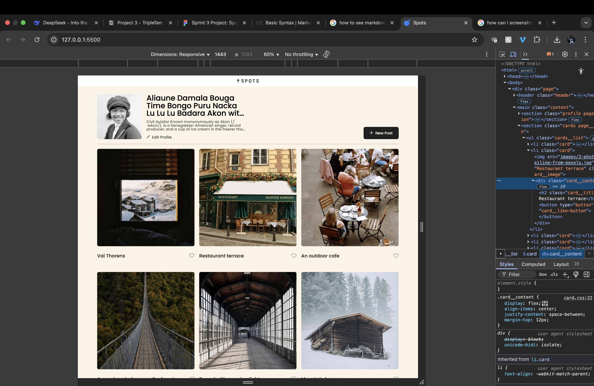
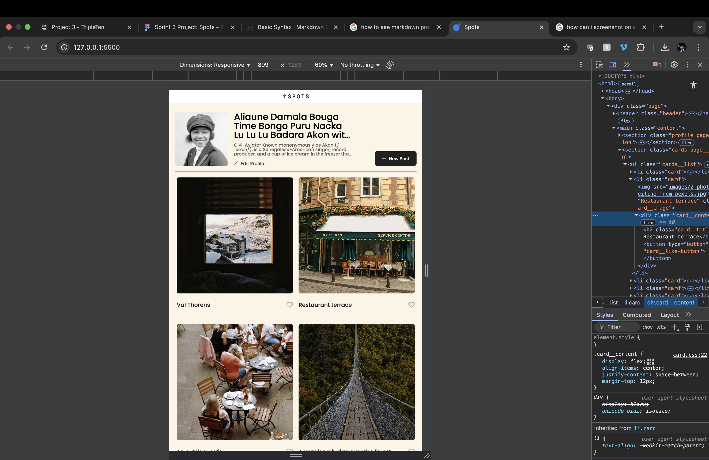
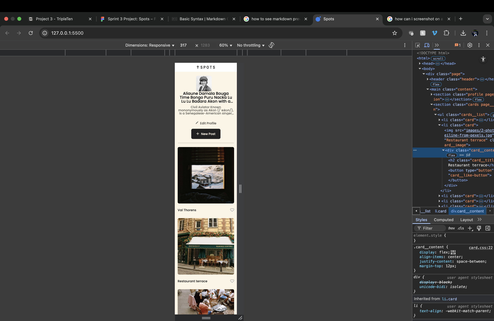

# Spots - Responsive Image Sharing Platform

 

A fully responsive image sharing website that adapts beautifully to all device sizes, built with modern CSS techniques following BEM methodology.

## ✨ Key Features

### Responsive Design
- **3 Layout Modes**:
  - 🖥️ Desktop (≥1024px): 3-column grid
  - 📱 Mobile (320px-764px): Single column
  - ↔️ Fluid transitions between breakpoints

### UI Components
- Dynamic card grid with automatic reflow
- Responsive typography using Poppins font family
- Intelligent text truncation (single & multi-line)
- Pixel-perfect implementation from Figma designs

## 🛠️ Technologies & Techniques

### Core Stack
- **HTML5** semantic markup
- **CSS3** with modern layout systems:
  - CSS Grid for the card system
  - Flexbox for component alignment
  - Media queries for responsive breakpoints

### Advanced Techniques
- **BEM methodology** for CSS architecture
- **Component-based styling** (1 CSS file per component)
- **Optimized assets**:
  - Web-optimized images
  - Efficient font loading via `@font-face`
- **Cross-browser compatibility**
- **Accessibility-focused** development:
  - Semantic HTML
  - Proper contrast ratios
  - Focus states

## 🎨 Visual Showcase

| Desktop View | Tablet View | Mobile View |
|--------------|-------------|-------------|
|  |  |  |

## 🗂️Project Strcuture
├── index.html # Main HTML file

├── styles # All project styles

├── images # All project images

├── header.css # Header component (logo styling)

├── card.css # Card component (card styling)

├── content.css # Content component (content styling)

├── page.css # Page component (page styling)

├── profile.css # Profile component (profile styling)

├── footer.css # Footer component (footer styling)

## 🚀 Deployment

Live Demo: [View on GitHub Pages](https://daeday242.github.io/se_project_spots/)

## ♿ Accessibility Features
- Semantic HTML5 structure

- Proper heading hierarchy

- Alt text for all images

- Sufficient color contrast

- Focusable interactive elements

- Responsive typography (rem units)

## 📝 Implementation Notes

- Breakpoints carefully chosen for smooth transitions
- All images optimized for fast loading
- Tested across Chrome, Firefox and mobile browsers
- Website Video Walkthrough: [Watch Explanation Here](https://drive.google.com/file/d/1wtdIBdAxt1FEHuU95mvL1ASAMxSb9ams/view?usp=drive_link) 

## 🌱Future Enhancements

- Implement dark mode support

- Add functional like button with counter

- Create responsive navigation menu

- Add form validation for profile editing

- Implement image loading optimization (lazy loading)